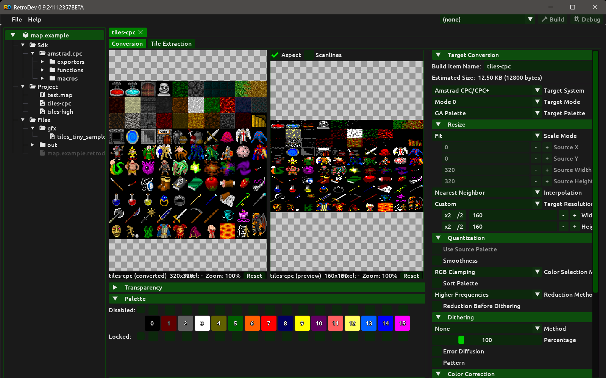

# Bitmap Conversion

A **Bitmap** build item converts a source image into the native pixel and colour format of the target system. When open, the editor shows the original image on the left and a live preview of the converted result on the right. Every parameter change updates the preview automatically so you can see the effect of your settings without building.

## Creating a bitmap build item

1. In the **Project** panel, right-click the source image file you want to convert.
2. Select **Add bitmap conversion** from the context menu. Retrodev creates the build item with that image already set as the source.
3. Configure the target system, mode and conversion parameters described below.
4. The live preview updates automatically as you change any setting.

## Preview

The editor shows two panels side by side: the original source image on the left and the converted result on the right. Both panels support the same navigation controls:

- **Zoom** — scroll the mouse wheel over the panel to zoom in or out.
- **Pan** — click and drag to move the image within the panel.
- **Reset** — double-click to reset zoom and pan back to fit the panel.
- **Pixel grid** — a grid overlay appears automatically when the zoom level is high enough to distinguish individual pixels.
- **Info bar** — each panel shows the image name, native resolution, current zoom level and the pixel coordinates under the cursor.

Zoom and pan are synchronised between the two panels so both always show the same region.

The converted panel has two additional display options that affect only the preview, not the conversion output:

- **Aspect** — applies the hardware display aspect ratio correction, stretching or squashing pixels to simulate how the image would appear on the actual target hardware display.
- **Scanlines** — overlays a scanline effect on the corrected preview. Only available when **Aspect** is enabled.

## The conversion pipeline

The conversion runs in a fixed order each time you change a setting:

1. **Resize** scales the source image to the target resolution using the selected scale mode and interpolation filter.
2. **Colour correction** is applied per pixel to the resized image — palette depth reduction, then per-channel multipliers, contrast, brightness and saturation — before each pixel is matched to the hardware palette.
3. **Quantization and dithering** map each colour-corrected pixel to the hardware palette, optionally distributing the quantization error across neighbouring pixels.

Understanding this order matters when tuning: colour correction affects the colours the quantizer sees, and both colour correction and dithering operate on the already-resized image at native target resolution.

## Parameters

### Target system

Selects the hardware to convert for. The choice of system determines which video modes, resolutions and palette types are available in the sections below.

### Target mode

The screen mode controls both the horizontal resolution and the maximum number of colours the hardware can display at once. Changing the mode resets the target resolution to the Normal size for that mode. On the Amstrad CPC:

- **Mode 0** — 160 × 200 pixels, up to 16 colours simultaneously. Each hardware pixel is 4 units wide and 2 units tall, giving a noticeably blocky, wide-pixel look.
- **Mode 1** — 320 × 200 pixels, up to 4 colours simultaneously. Pixels are 2 units wide and 2 units tall — square at normal display aspect ratio. The most common mode for games.
- **Mode 2** — 640 × 200 pixels, up to 2 colours simultaneously. Pixels are 1 unit wide and 2 units tall. Used for text and high-detail monochrome graphics.

### Resolution

Controls the dimensions of the converted output image.

- **Normal** — the standard screen area for the selected mode. The exact dimensions depend on the target system and mode; on the Amstrad CPC in Mode 1, for example, this is 320 × 200 pixels. This is what most programs target.
- **Overscan** — the larger hardware-supported area that extends beyond the standard display boundary, allowing graphics to fill the entire visible screen surface. The overscan dimensions also depend on the target system and mode; on the Amstrad CPC in Mode 1 this is 384 × 272 pixels.
- **Custom** — lets you set arbitrary target dimensions. Useful for graphics that are not full-screen, such as a title card or a background panel.
- **Original** — uses the source image dimensions as the target size, bypassing any rescaling to a predefined hardware resolution. Useful when you have already prepared the source at the correct pixel dimensions.

### Palette type

Selects which hardware palette the converted image will target. The available types depend on the selected target system; a system may expose more than one palette type when its hardware provides distinct colour sets for different purposes — for example, a standard screen palette alongside an enhanced one, or a separate palette used exclusively by hardware sprites.

On the Amstrad CPC, for example, the available types are:

- **GA Palette** — the gate array palette used by the standard CPC 464, 664 and 6128. It provides 27 fixed hardware colours.
- **ASIC Palette** — the enhanced palette of the CPC+ and GX4000. It provides a full 12-bit colour range (4096 colours) with independent RGB control per pen.

Changing the palette type invalidates the current palette configuration because the available colour set changes between types.

### Palette

The palette panel shows one slot per hardware pen for the selected mode. You can constrain how individual pens behave during quantization:

- **Lock** — a locked pen keeps its currently assigned hardware colour. The quantizer may still use that colour when mapping pixels, but it will not try to reassign the pen to a different colour. Use this to guarantee that a specific pen always holds a fixed colour — for example, the background or a sprite colour that must match another graphic.
- **Enable / Disable** — a disabled pen is completely excluded from quantization. The quantizer will not assign any image colour to that pen, and it will not appear in the converted output. Use this to reserve pens for colours that will be loaded at runtime by your program.
- **Colour assignment** — you can manually assign a specific hardware colour to a pen directly in the palette panel. A pen with a manually assigned colour behaves as locked: the quantizer will use it but will not change it.

### Resize

Before the image reaches the quantizer it is scaled to the target resolution. Two independent settings control this step.

**Scale mode** — determines how the source dimensions are mapped to the target:

- **Fit** — stretches the source to exactly fill the target resolution, scaling each axis independently. Aspect ratio is not preserved; the image will appear distorted if the source and target have different proportions. Use this when the source was already prepared at the correct ratio, or when distortion is intentional.
- **Smallest** — scales the source uniformly so that the entire image fits inside the target rectangle, using the smaller of the two scale factors (width and height). The aspect ratio is preserved, but any area not covered by the image is filled with a background colour — similar to letterboxing or pillarboxing.
- **Largest** — scales the source uniformly so that it completely covers the target rectangle, using the larger of the two scale factors. The aspect ratio is preserved, but the portion of the source that extends beyond the target boundary is cropped from the centre. This is a fill-and-crop mode.
- **Custom** — uses a user-defined rectangle (X, Y, width, height) within the source image as the region to sample, then stretches that region to fill the target. Useful for converting a specific part of a larger source image.
- **Original** — copies the source into the target at 1:1 pixel scale with no resampling. If the source is smaller than the target, only the area covered by the source is written. If the source is larger, it is cropped at the target boundary starting from the top-left corner.

**Interpolation mode** — selects the filter used when pixels are resampled during scaling. This only has a visible effect when the scale ratio is not 1:1:

- **Nearest Neighbor** — picks the single closest source pixel for each output pixel. No blending occurs. Produces hard, aliased edges and preserves the exact colours of the source. The best choice for indexed-colour pixel art where intermediate colours should not be introduced.
- **Low** — a fast box-like filter. Slightly smoother than nearest-neighbor but still quite blocky. Useful for quick preview rendering.
- **Bilinear** — blends between four neighbouring source pixels using linear interpolation. Smooth results, good balance between quality and processing speed for photographic sources.
- **High Bilinear** — an antialiased, prefiltered variant of bilinear interpolation. Produces better results than plain bilinear, particularly when scaling down.
- **Bicubic** — uses the Mitchell-Netravali cubic kernel to sample a 4 × 4 neighbourhood of source pixels. Produces smoother results than bilinear with more detail preserved, at the cost of additional processing.
- **High Bicubic** — a higher-quality bicubic variant that reduces ringing and edge artifacts compared to standard bicubic.
- **High** — the highest-quality filtering mode, prioritising sharpness and fine detail retention. Best for sources with high-frequency content such as linework.

**Transparent colour** — if enabled, pixels in the source that match the given RGB colour within an adjustable tolerance are excluded from quantization entirely. The colour does not occupy any palette pen and is invisible to the converted output — it simply disappears from the result. This chroma-key approach is useful for source images that use a background colour such as "magic pink" instead of a real alpha channel.

When enabled, the following controls appear to configure the colour and how it is selected:

- **Colour swatch** — shows the currently assigned transparent colour. Click it to open a colour picker where you can set the RGB values manually. The picker also provides quick-preset buttons for common chroma-key colours: magenta, green, cyan and black.
- **Pick** — enters picking mode. Click any pixel in the source image to use that pixel's colour as the transparent colour. The transparent colour option is automatically enabled when a colour is picked.
- **Tolerance** — sets how closely a pixel must match the target colour to be considered transparent. A value of 0 requires an exact match; higher values (around 10–30) include pixels whose colour is similar but not identical, which is useful when the source has been saved with lossy compression.
- **Transparent pen** — selects a specific hardware pen slot that will be used as the transparency marker in raw-data exports. When set, the quantizer never assigns any colour to that pen slot — it is reserved exclusively for transparent pixels. Your export script can then treat that pen index as the "no pixel" sentinel at runtime. Set to **None** to disable (no pen is dedicated to transparency). See the note below for guidance on when to use this option.

> **Choosing the right transparency path:**
>
> - **Chroma-key only (Transparent colour, no Transparent pen):** pixels matching the transparent colour are excluded from quantization and produce no output colour. Use this for exports where transparency is implied by the format — for example, a raw pixel stream, a font, or a compressed tile format where the consumer already knows which pen means "skip". No pen slot is wasted.
>
> - **Transparent pen (with or without Transparent colour):** reserves a specific pen slot so your export script can use its index as an explicit "no pixel" marker at runtime. The quantizer never assigns any colour to that slot, so no image colour is displaced by the transparency key. Use this for sprites or tiles where the runtime checks the pen index directly — for example, a blitter loop that skips pixels equal to pen 0. The colour placed in that slot by the palette solver is arbitrary and should be ignored by your export script. In the palette solver result display the participant's result line notes how many pens were assigned plus "+1 transparent (pen N)" to show the reserved slot.

If the source image is RGBA and already contains an alpha channel, transparency is handled automatically without enabling this option: pixels with alpha equal to 0 are treated as transparent and skipped during quantization. Transparency is ON/OFF only — a pixel is either fully transparent (alpha = 0) or fully opaque (any other alpha value); partial transparency is not supported.

### Colour correction

Colour correction is applied to each pixel of the resized image before palette matching. All adjustments run in order: bit depth reduction first, then per-channel multiplication, then contrast, then brightness and saturation.

- **Red / Green / Blue channel** — per-channel multipliers expressed as a percentage, where 100 means unchanged. Reducing a channel pushes the image toward the complementary colour; raising it amplifies that channel. Useful for compensating for the colour response of CRT displays or for giving a warm or cool tint to the conversion.
- **Contrast** — scales the luminance of each pixel around the midpoint. Values above 100% increase the difference between light and dark areas; values below 100% flatten the image toward grey.
- **Brightness** — scales the overall luminosity. Values above 100% push pixels brighter; values below 100% darken the image.
- **Saturation** — controls the colour intensity. At 0% the image is rendered in greyscale; at 100% colours are unchanged; above 100% colours are made more vivid.
- **Colour bits** — reduces the bit depth of each colour component before quantization: 24 bits leaves the image unchanged (8 bits per channel), 12 bits truncates to 4 bits per channel, 9 bits to 3, and 6 bits to 2. Reducing the bit depth forces all source colours to snap to a coarser grid, which can improve matching against hardware palettes that have similar colour resolution.
- **Palette reduction lower limit** — applies an OR mask to every pixel's R, G and B components, raising the minimum value each component can take. This prevents very dark colours from being quantized to pure black. The masks 0x11, 0x22 and 0x33 progressively lift the floor of the colour range; 0x33 applies both 0x11 and 0x22 simultaneously.
- **Palette reduction upper limit** — applies an AND mask to every pixel's R, G and B components, lowering the maximum value each component can reach. This prevents very bright colours from reaching full white. The masks 0xEE, 0xDD and 0xCC progressively clip the ceiling of the colour range; 0xCC applies both 0xEE and 0xDD simultaneously.

### Quantization

Quantization maps each pixel of the resized image to the closest available hardware colour and accumulates a frequency histogram used by the colour reduction step.

- **Smoothness** — before each pixel is matched to the palette, it is blended with its four cardinal neighbours (above, below, left, right). The current pixel contributes with weight 4 and each neighbour contributes with weight 1, producing a weighted average. The effect is a slight blur that reduces high-frequency noise before palette matching, improving the appearance of gradients at low colour counts at the cost of softening hard edges.
- **Sort palette** — when enabled, the hardware pen slots are reordered after colour reduction, keeping the palette order consistent and predictable in the converted output.
- **Reduction method** — determines how the colour reduction step fills the available pen slots from the histogram:
  - **Higher Frequencies** — fills each pen with the most frequently occurring colour in the image histogram, assigning the most common colour to pen 0, the next most common to pen 1, and so on. Guarantees that the colours covering the most pixels are always represented.
  - **Higher Distances** — assigns the first pen by frequency, then alternates between frequency and maximum colour distance. This spreads the pens across the colour space rather than clustering them around similar hues, which improves the perceptual diversity of the palette.
- **Reduction before dithering** — when enabled, colour reduction runs before the dithering pass so the quantizer sees the reduced palette when distributing error. When disabled, dithering runs first and colour reduction is applied to the dithered result.
- **Use source palette** — when the source image is a paletised PNG, enabling this option copies the palette entries from the source file directly into the pen slots, skipping the quantization fitting step entirely. This lets you pre-assign hardware colours in your image editor and have them transferred as-is. If the source palette contains more entries than the hardware maximum, the extra entries are clamped and a warning is logged to the console.

### Dithering

Dithering distributes the quantization error — the difference between the original pixel colour and the nearest available hardware colour — across neighbouring pixels. The result is that the eye perceives an intermediate colour not present in the hardware palette.

**Method** — selects the dithering algorithm:

- **None** — no dithering. Each pixel is mapped to the single closest hardware colour. Produces the sharpest result with the most obvious colour banding on gradients.
- **Floyd-Steinberg (2×2)** — classic error diffusion. The quantization error for each pixel is spread to four neighbours with weights 7/16 (right), 3/16 (lower-left), 5/16 (below) and 1/16 (lower-right). Produces smooth gradients and is the best general-purpose choice for photographic images. Can introduce a slightly noisy, organic texture.
- **Bayer 1 (2×2)** — the smallest ordered Bayer threshold matrix. Fast, produces a visible crosshatch pattern. Best suited to very low-resolution output or 1-bit displays.
- **Bayer 2 (4×4)** — the classic 4×4 Bayer matrix with 16 threshold levels. Produces a regular dot pattern similar to a halftone screen. A good general-purpose ordered dither for retro hardware with limited palettes such as CPC Mode 1.
- **Bayer 3 (4×4)** — a variant 4×4 Bayer with a different threshold arrangement, producing a shifted pattern. Useful for A/B comparisons with Bayer 2.
- **Ordered 1 (2×2)** — a sequential 2×2 threshold that grows dots in a simple pattern. Best for small sprites or tile graphics.
- **Ordered 2 (3×3)** — a 9-level threshold in an odd-sized grid. The non-power-of-two size avoids the moiré patterns that even-sized matrices can produce.
- **Ordered 3 (4×4)** — a standard 4×4 ordered dither. A reliable all-rounder for retro platforms with 4- or 16-colour palettes.
- **Ordered 4 (8×8)** — a large 64-level threshold matrix. Produces the smoothest gradients of all ordered methods, best suited to higher-resolution output.
- **ZigZag 1 (3×3)** — a sparse diagonal scatter matrix with zero entries at most positions. Produces a stylistic diagonal line pattern, useful for artistic effects on coarse palettes.
- **ZigZag 2 (4×3)** — a non-square zigzag matrix. The wider horizontal extent suits the wide-pixel aspect ratio of CPC Mode 0, where a square matrix would produce a visually distorted pattern.
- **ZigZag 3 (5×4)** — the largest zigzag variant. Very sparse, producing an open dither pattern with wide spacing between affected pixels. Suits wide-pixel modes where fine detail would be lost anyway.
- **Checkerboard Heavy (4×4)** — a strong alternating pattern with high contrast. Adjacent pixels are pushed far apart in colour, producing a coarse, obvious checkerboard texture.
- **Checkerboard Light (4×4)** — a subtle alternating pattern with low contrast. The texture is barely visible at normal viewing distance, useful for gently smoothing transitions without a prominent grid.
- **Checkerboard Alternate (4×4)** — a medium-strength alternating pattern, between Light and Heavy in intensity.
- **Diagonal Wave (2×4)** — a horizontal stripe pattern with a wave-like diagonal offset. Creates a banded, horizontally-oriented texture.
- **Sparse Vertical (2×3)** — an asymmetric sparse pattern with a vertical bias. Fewer pixels are dithered, and their placement is distributed with a slight vertical tendency.
- **Sparse Horizontal (3×2)** — the horizontal counterpart to Sparse Vertical. Fewer dithered pixels, distributed with a slight horizontal tendency.
- **Cross Pattern (4×4)** — a repeating diamond-like cross pattern. Produces a structured, geometric texture that is distinct from checkerboard or Bayer styles.
- **Cluster Dots (3×3)** — an aggressive matrix with high threshold values. Produces very distinct, well-separated dots, best used on images with strong colour contrast.
- **Gradient Horizontal (2×4)** — a sequential 0–7 gradient threshold running horizontally across the matrix tile. Creates a smooth horizontal banding effect that repeats every two pixels vertically.
- **Gradient Diagonal (4×4)** — a diagonal sweep pattern running corner to corner. Produces a halftone-like diagonal fade across each 4×4 tile.

**Percentage** — scales the strength of the dithering effect from 0% (no dithering regardless of the selected method) to 400% (four times the normal effect). Values above 100% push the dithering more aggressively, which can help at very low colour counts but may introduce visible noise.

**Error diffusion** — when enabled, Floyd-Steinberg-style error propagation is applied on top of the selected matrix method, spreading the residual quantization error to neighbouring pixels in addition to the matrix threshold. Has no additional effect when Floyd-Steinberg itself is the selected method.

**Pattern** — switches the quantizer to an alternating scanline pattern mode. Instead of mapping each pixel individually, pairs of consecutive scanlines are combined: each pair of vertically adjacent pixels is averaged and then split into two colours — one slightly darker (controlled by the **Pattern Low** divisor) and one slightly lighter (controlled by the **Pattern High** divisor). These two colours are alternated in a checkerboard arrangement across the two scanlines. The effect mimics the interlaced palette mixing technique used in some CPC demos, producing perceived colour blending that is not achievable with standard per-pixel quantization.

## Export

A bitmap build item produces its converted data in memory. To write it to disk, attach an AngelScript export script via the **Export** section of the build item. The script receives the converted image, the output path and a `BitmapExportContext` object that exposes the native dimensions, the target system, the target mode and the hardware palette — all the information needed to pack the data into any binary format your program requires. For the complete documentation on scripted export, click [here](export-scripts.md).

