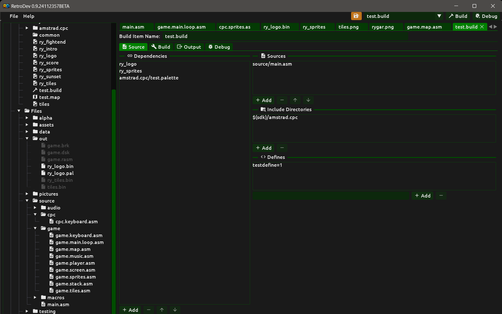
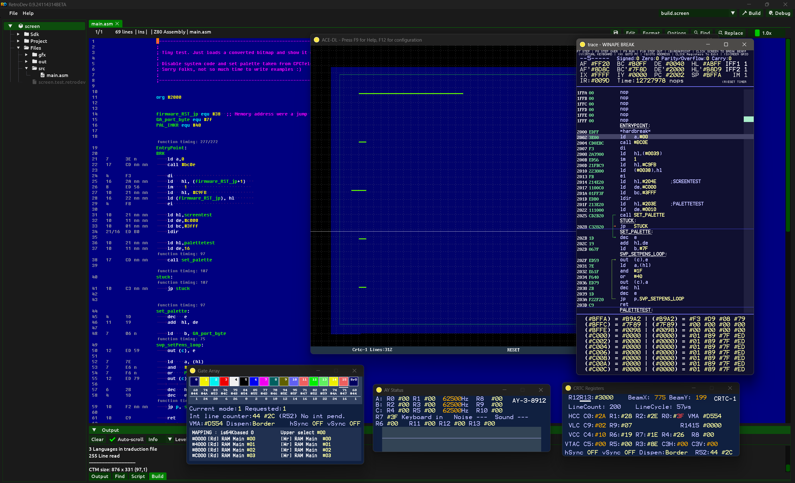

# Build Pipeline

A **Build** item ties assembler sources, project dependencies and an emulator launch configuration into a single reproducible pipeline step.

## Creating a build item

In the **Project** panel, click **Add → Build** and give it a name (e.g. `game`, `level1`, `loader`). The name is shown in the active-build selector in the toolbar and can be changed at any time from the name field at the top of the Build item editor — type a new name and press `Enter` to apply.

## Triggering a build

The toolbar at the top of the application window contains:

- A **combo box** listing all Build items in the project. Select the one to make active.
- A **Build** button that runs the active Build item.
- A **Debug** button that runs the active Build item and, if it succeeds, launches the configured emulator.
- A **save indicator** (amber floppy icon) that appears when the project has unsaved changes; clicking it saves the project immediately.

Pressing **`F5`** is equivalent to clicking **Debug** — it builds the active item and launches the emulator on success.

Before invoking the assembler

## Source tab

The Source tab is split into two columns. The left column holds **Dependencies**; the right column holds **Sources**, **Include Directories** and **Defines**.

### Dependencies

An ordered list of other project items (Bitmap conversions, Tilesets, Sprites, Maps, Palettes) that must be processed before the assembler runs. Retrodev processes them in the order shown. Use the **+** button to pick from all available project items — each entry is shown as `name  [Type]` to distinguish items with the same name. Use **−** to remove, **↑ / ↓** to reorder.

### Sources

The list of `.asm` / `.z80` source files to pass to RASM. Use **+** to pick from source files tracked in the project, **−** to remove, **↑ / ↓** to reorder. Each source file is assembled independently.

### Include Directories

The include search path list passed to the assembler. Use **+** to pick from folders already tracked in the project; the picker only shows folders not already in the list. Use **−** to remove an entry. Retrodev formats the list into the appropriate flags for the active build tool automatically.

### Defines

Preprocessor symbols injected before assembly. Type a `KEY=value` pair or a bare flag name into the input field and press **Add**. Select an entry and press **−** to remove it.

## Build tab

Selects the build tool and configures its assembly-phase options. The currently available tool is **RASM**.

### RASM — Warnings and Errors

| Option | Flag | Description |
|---|---|---|
| Suppress all warnings | `-w` | Silence all warning messages |
| Suppress slow-crunch warning | `-wc` | Silence the warning for slow crunch operations only |
| Treat warnings as errors | `-twe` | Abort assembly if any warning is emitted |
| Extended error display | `-xr` | Show additional context around each error |
| Warn on unused symbols | `-wu` | Emit a warning for every symbol that is defined but never referenced |
| Max errors | `-me N` | Stop after N errors; 0 = no limit |

### RASM — Compatibility

| Option | Flag | Description |
|---|---|---|
| Assembler compatibility | `-ass` / `-uz` | AS80 or UZ80 syntax compatibility mode |
| DAMS dot-label convention | `-dams` | Accept DAMS-style dot-prefixed local labels |
| PASMO compatibility | `-pasmo` | Accept PASMO syntax extensions |
| Maxam-style expression floor | `-m` | Use Maxam-style floor truncation for floating-point expressions |
| Use & for hex values | `-amper` | Accept `&1A2B` as a hex prefix in addition to `0x` and `#` |
| Free quote mode | `-fq` | Treat all characters inside quotes literally |
| UTF-8 keyboard translation | `-utf8` | Translate UTF-8 multi-byte sequences to CPC character codes |
| Module separator | `-msep X` | Character between module name and symbol name (default `.`) |

### RASM — Macro Behaviour

| Option | Flag | Description |
|---|---|---|
| Void macro mode | `-void` | Accept macro calls without parameters even when parameters are declared |
| Multi-line macro parameters | `-mml` | Allow macro invocations to span multiple lines |

### RASM — Diagnostics

| Option | Flag | Description |
|---|---|---|
| Display assembler statistics | `-v` | Print pass count, binary size and timings after a successful assembly |
| Verbose bank map output | `-map` | Display detailed bank map and segment layout during early assembly stages |
| Suppress CPR bank info | `-cprquiet` | Disable the detailed ROM/cartridge bank information in cartridge mode |

A read-only **Generated options** field at the bottom shows the exact command-line flags that will be passed to RASM.

## Output tab

Configures the output file paths and symbol export format for RASM.

### Output Radix

The output radix is the common path prefix for all generated output files.

- **Automatic radix from input filename** (`-oa`) — derive the prefix from the source filename automatically.
- **Output radix** (`-o`) — explicit prefix path (e.g. `out/`). Disabled when automatic radix is on.

### File paths

| Section | Field | Flag | Description |
|---|---|---|---|
| Binary | Binary file | `-ob` | Raw binary output (`.bin`) |
| ROM / Cartridge | ROM file | `-or` | ROM image (`.xpr`) |
| ROM / Cartridge | Cartridge file | `-oc` | CPC cartridge image (`.cpr` / `.xpr`) |
| Snapshot | Snapshot file | `-oi` | Amstrad CPC snapshot (`.sna`) |
| Tape | Tape file | `-ot` | Tape image (`.cdt` / `.tzx`) |
| Symbol / Breakpoint | Symbol file | `-os` | Symbol / label export file |
| Symbol / Breakpoint | Breakpoint file | `-ok` | Breakpoint export file |
| Symbol / Breakpoint | CPR info file | `-ol` | ROM label (CPR info) file |

### Symbol Export

Selects the format written to the symbol file (`-os`):

| Format | Flag | Description |
|---|---|---|
| None | — | No symbol file written |
| Default | `-s` | Plain address=label pairs |
| Pasmo | `-sz` | Pasmo-compatible format |
| Winape | `-sw` | WinAPE breakpoint/symbol format |
| Custom | `-sc` | User-defined printf-style format string |

Additional symbol export options:

| Option | Flag | Description |
|---|---|---|
| Include local labels | `-sl` | Include `@`-prefixed module-local labels |
| Include variable symbols | `-sv` | Include `DEFW`/`DEFB`/`DEFD` variable symbols |
| Include EQU symbols | `-sq` | Include `EQU` constant definitions |
| Split symbols by memory bank | `-sm` | Write one symbol file per memory bank |
| Preserve symbol case | `-ec` | Keep original label capitalisation |
| Export RASM super-symbol file | `-rasm` | Write a `.rasm` super-symbol file for use with ACE-DL |
| Export breakpoints to file | `-eb` | Write breakpoints to the breakpoint file path |

> **Note:** when both `-rasm` and a standard symbol format (`-s` / `-sz` / `-sw` / `-sc`) are active, the `-os` path cannot be shared between the two outputs. Leave `-os` empty and enable `-oa` so RASM auto-derives both `.sym` and `.rasm` filenames from the source filename.

### DSK / EDSK

- **Overwrite existing DSK files** (`-eo`) — overwrite a file on a DSK/EDSK image if a file with the same name already exists.

## Debug tab

The Debug tab has two parts: RASM-specific debug output options, followed by the common **Emulator Launch** section.

### RASM — Snapshot

| Option | Flag | Description |
|---|---|---|
| Embed symbols in snapshot | `-ss` | Embed exported symbols in the snapshot file (SYMB chunk, ACE-compatible) |
| Embed breakpoints in snapshot | `-sb` | Embed breakpoints in the snapshot file (BRKS/BRKC chunks) |
| Write snapshot version 2 | `-v2` | Write a version 2 snapshot instead of the default version 3 |

### RASM — CPR Info

- **Export ROM labels to CPR info file** (`-er`) — write ROM labels to the CPR info file whose path is set in the Output tab.

### Emulator Launch

Select the emulator from the **Emulator** combo: **None**, **WinAPE**, **RVM** or **ACE-DL**.

The **Executable** path is stored in Retrodev application settings on your machine and is shared across all projects. Click the folder icon to browse for the emulator executable. The remaining fields are stored in the project file.

**Media:**

- **Media file** — disc, tape or cartridge image to load (`.dsk`, `.hfe`, `.cdt`, `.wav`, `.xpr`, `.cpr`, `.sna`). Browse picks from files tracked in the project.
- **Snapshot** — snapshot file to load (`.sna`).

**Debug:**

- **Symbol file** — symbol file to pass to the emulator. Not supported by RVM.

**Startup:**

- **Send |CPM on startup** — send the `|CPM` command on startup. When active, the command field below is disabled.
- **Command** — startup command sent to the emulator after boot. The label and behaviour differ by emulator:
  - **WinAPE** — Program to run (`/A:`). Leave empty to use `/A` without a program name.
  - **RVM** — BASIC command (`-command=`). Example: `run"disc\n` (`\n` = Enter key).
  - **ACE-DL** — Auto-run file (`-autoRunFile`). Sends `RUN"<file>` to the CPC on startup.

**Emulator-specific options:**

*RVM:*
- **Machine** (`-boot=`) — `cpc464`, `cpc664` or `cpc6128` (default `cpc6128`).

*ACE-DL:*
- **CRTC type** (`-crtc`) — select CRTC type 0–4, or leave as *Not set*.
- **RAM** (`-ram`) — 64 KB, 128 KB, 320 KB, 576 KB, or *Not set*.
- **Firmware** — UK (`-fuk`), FR (`-ffr`), SP (`-fsp`), DK (`-fdk`), or default.
- **Speed** (`-speed`) — 50 %, 100 %, 150 %, 200 %, MAX, or default.
- **Disable debug windows** (`-alone`) — emulator-only mode, no debug windows.
- **Do not load/save configuration** (`-skipConfigFile`) — skip the ACE-DL config file on startup.
