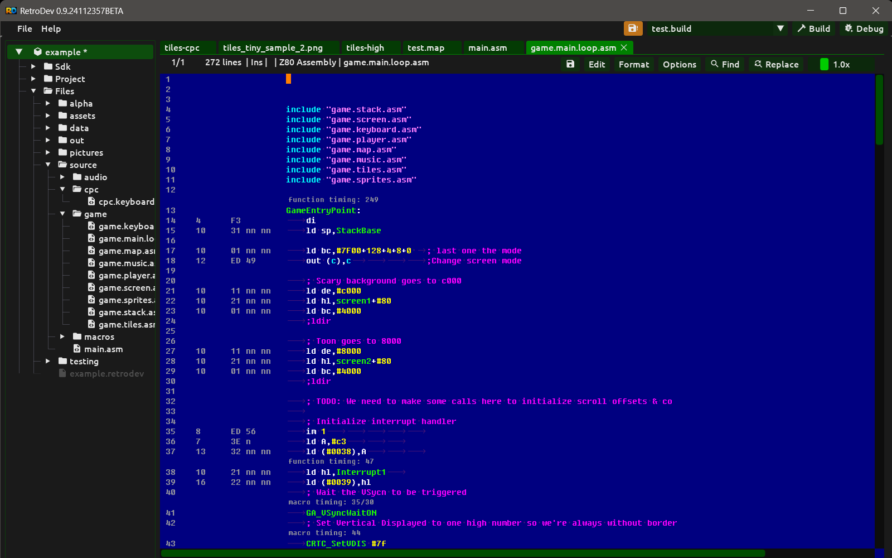
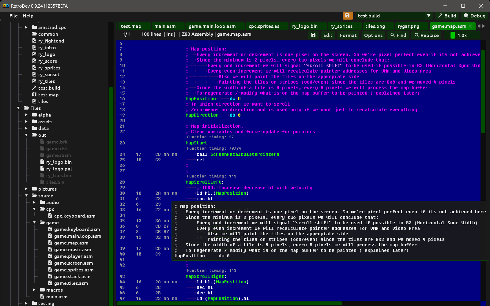

# Code Editor

<div align="center"></div>

The integrated code editor supports Z80 assembly (RASM dialect) and AngelScript. It is used for writing assembler sources and export scripts without leaving Retrodev.

## Supported languages

| Language | File extensions | Features |
|---|---|---|
| Z80 Assembly (RASM) | `.asm`, `.z80` | Syntax highlighting, directive completion, label/symbol autocomplete, codelens timings, hover documentation |
| AngelScript | `.as` | Syntax highlighting, API autocomplete, hover documentation |

## Z80 assembly features

### Syntax highlighting

Keywords, directives, registers, opcodes, labels, strings, comments and numeric literals are all coloured independently.

### Codelens — instruction timing annotations

Every Z80 instruction line is annotated with its timing inline, directly in the editor margin. This lets you reason about inner loop performance without consulting a reference table. On the Amstrad CPC the relevant unit is the number of NOPs: one NOP = 4 T-states (1 μs at 4 MHz).

<div align="center"></div>

### Auto-complete

Start typing a label, directive or register name and a completion popup appears. Completions come from:

- **Directives** — the full RASM directive set.
- **Labels and symbols** — all labels defined in all open source files in the project.
- **Built-in registers and opcodes** — Z80 register names and instruction mnemonics.

Auto-complete is suppressed inside comments so it does not interfere with annotation text.

### Hover documentation

Hover over a label or directive to see its definition, value or documentation. Hover is suppressed over comment tokens.

### RASM directive reference

A full RASM directive reference is bundled in the editor. See [doc/tech/rasm-directives.md](../tech/rasm-directives.md) for the standalone reference document.

## AngelScript features

The AngelScript editor provides auto-complete and hover documentation for the full Retrodev export API: `IBitmapContext`, `ITilesetContext`, `ISpriteContext`, `IMapContext`, `IPaletteContext` and their methods.

## Toolbar

The toolbar runs across the top of every open document. On the left it shows a live status line:

```
line / column   total lines   Ins   *   language   filename
```

- **line / column** — current cursor position (1-based).
- **total lines** — total number of lines in the document.
- **Ins** — always shown; indicates the editor is in insert mode.
- **\*** — appears when the document has unsaved changes (current text differs from the text at load time).
- **language** — active syntax highlighting language (e.g. `Z80 Asm`, `C++`, `None`).
- **filename** — name of the open file.

The right side of the toolbar contains the action buttons described below, followed by a **font scale slider** (0.5× – 3.0×) that scales only the editor text without affecting the rest of the UI.

### Edit menu

| Item | Shortcut | Notes |
|---|---|---|
| Undo | `Ctrl+Z` | Disabled when there is nothing to undo |
| Redo | `Ctrl+Y` | Disabled when there is nothing to redo |
| Cut | `Ctrl+X` | Disabled in read-only mode |
| Copy | `Ctrl+C` | |
| Paste | `Ctrl+V` | Disabled in read-only mode |

### Format menu

Both items are disabled when the document is open in read-only mode.

- **Tabbify** — converts leading indentation spaces to tabs on every line, using the current tab size (4 spaces = 1 tab).
- **Untabify** — converts leading indentation tabs to spaces on every line, expanding each tab to the current tab size.

Trailing whitespace on each line is stripped by both operations.

### Options menu

- **Line Numbers** — toggles the line number gutter on or off.
- **Timing** — shows or hides the codelens timing annotations in the editor margin (Z80 assembly files only).
- **Timing Type** — selects what the timing annotations display. Only available for Z80 assembly files.
  - **Cycles** — T-state count for each instruction.
  - **Cycles+M1** — T-state count with the M1 opcode-fetch cycle counted separately (as the Amstrad CPC Gate Array does). On the CPC, dividing the Cycles+M1 total by 4 gives the number of NOPs the instruction costs.
  - **Instructions** — number of NOPs equivalent for each instruction, using the NOP as the baseline timing unit.
  Changing the timing type re-parses all open codelens files so the new values appear immediately.
- **Bytecode** — shows or hides the encoded opcode bytes inline next to each instruction (Z80 assembly files only).
- **Palette** — switches the editor colour theme. Available themes: **Dark**, **Light**, **Mariana**, **RetroBlue** (default).

### Find and Replace

The **Find** button (or `Ctrl+F`) opens a panel at the bottom of the editor. The **Replace** button (or `Ctrl+H`) opens the same panel with an additional replace row. Press `Escape` or the close button to dismiss the panel.

**Find row:**

- **Search input** — type the text to search for. Press `Enter` to advance to the next match.
- **◀ / ▶** — step to the previous or next match.
- **Find All** — collects all matches in the document and writes one navigable entry per match to the **Find** channel in the console, showing the file path and line number.
- **Case sensitive toggle** — highlighted when active; when off, search is case-insensitive.

**Replace row (visible in Replace mode):**

- **Replace input** — the text to substitute.
- **Replace** — if the current selection does not already match the search term, advances to the next match first; then replaces the selection and moves to the next match.
- **Replace All** — snapshots all current occurrences before replacing, then replaces exactly that many times in order. This prevents newly introduced occurrences (when the replacement text contains the search text) from being matched. Results are logged to the **Find** channel with the original line content so unintended replacements can be spotted.

The scope label **Scope: Whole document** is always shown at the right edge of the panel; search never crosses file boundaries.

### Context menu

Right-clicking on a word opens a context menu. If the word under the cursor resolves to a known symbol in the codelens registry, a **Go to Definition** entry appears at the top — clicking it opens the file that defines the symbol and scrolls to the definition line. Below that the standard edit actions are available: Undo, Redo, Cut, Copy, Paste, Select All.

## Keyboard shortcuts

| Shortcut | Action |
|---|---|
| `Ctrl+S` | Save |
| `Ctrl+Z` | Undo |
| `Ctrl+Y` | Redo |
| `Ctrl+A` | Select all |
| `Ctrl+C` | Copy |
| `Ctrl+X` | Cut |
| `Ctrl+V` | Paste |
| `Ctrl+F` | Find |
| `Ctrl+H` | Replace |
| `Tab` | Indent selection |
| `Shift+Tab` | Unindent selection |
