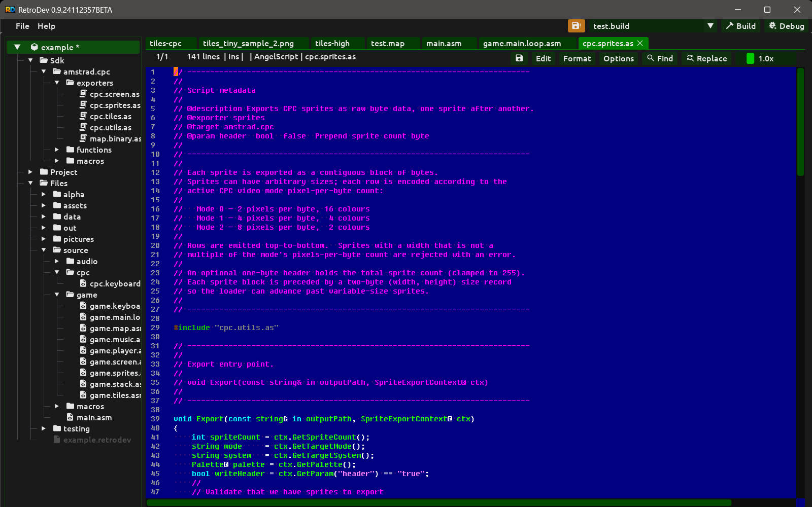

# Export Scripts

<div align="center"></div>

Export scripts are AngelScript files that receive fully converted data and write it in exactly the format your program expects. They have full control over binary layout, headers, compression and file naming.

## Script anatomy

Every export script begins with a metadata block of `// @tag value` comment lines. Retrodev reads these tags before running the script to build the parameter UI and to show only relevant scripts in the picker.

```angelscript
// @description Exports CPC screen data, chunky or native screen memory layout.
// @exporter    bitmap
// @target      amstrad.cpc
// @param layout         combo  chunky  chunky|screenmemory             Memory layout
// @param exportPalette  bool   false                                   Export palette (.pal file)
// @param paletteFormat  combo  systemindex  systemindex|hardwareindex|hardwarecmd  Palette format
```

### Metadata tags

| Tag | Description |
|---|---|
| `@description` | One-line human-readable description shown in the script picker UI. |
| `@exporter` | Type of data exported: `bitmap`, `tiles`, `sprites`, `map`, `util`. A `util` script contains shared helper functions and is not shown in the export picker — it is only ever pulled in via `#include` from another script. |
| `@target` | Target system identifier: `amstrad.cpc`, `spectrum`, `c64`, `msx`. Omit for system-agnostic scripts. Note: `spectrum`, `c64` and `msx` are reserved identifiers but not yet implemented — if you want to help add one of these systems, read the [adding systems guide](../tech/adding-systems.md). |
| `@param` | Declares a user-configurable parameter (see below). |

### `@param` syntax

```
// @param  <key>  <type>  <default>  <label...>
```

| Type | UI control | Default format | Example |
|---|---|---|---|
| `bool` | Checkbox | `true` or `false` | `@param header bool false Prepend sprite count byte` |
| `int` | Integer spinner | Any decimal integer | `@param baseAddress int 16384 Base load address` |
| `string` | Text field | Single word | `@param suffix string bin File extension` |
| `combo` | Drop-down | One of the options | `@param layout combo chunky chunky\|screenmemory Memory layout` |

For `combo`, options are pipe-separated and follow the default value. Retrodev builds the UI controls automatically; the script reads values at export time via `ctx.GetParam("key")`.

## Including other scripts

Any export script can include another script with a standard `#include` directive:

```angelscript
#include "cpc.utils.as"
```

The path is resolved relative to the including script. If the script you want is part of the SDK, no additional setup is needed — just add the `#include` line and the functions it provides become available immediately. Scripts tagged `@exporter util` exist specifically to be included this way; they contain shared helpers and are never shown in the export picker themselves.

## Entry point signatures

The entry point function name is always `Export`. Its signature depends on the exporter type:

```angelscript
// Bitmap
void Export(Image@ image, const string& in outputPath, BitmapExportContext@ ctx)

// Tileset
void Export(const string& in outputPath, TilesetExportContext@ ctx)

// Sprites
void Export(const string& in outputPath, SpriteExportContext@ ctx)

// Map
void Export(const string& in outputPath, MapExportContext@ ctx)
```

## Common context methods

All context types expose `GetParam`, `GetTargetSystem` and `GetTargetMode`:

```angelscript
string layout = ctx.GetParam("layout");       // value chosen by the user in the Export panel
string system = ctx.GetTargetSystem();         // e.g. "amstrad.cpc"
string mode   = ctx.GetTargetMode();           // e.g. "Mode 0", "Mode 1", "Mode 2"
```

## Palette API

Bitmap, tileset and sprite contexts all expose a `GetPalette()` method that returns a `Palette@` handle. This gives the script access to the palette associated with the converted data, so it can export hardware colour values alongside the pixel bytes.

```angelscript
Palette@ palette = ctx.GetPalette();

int penCount = palette.PaletteMaxColors();         // number of active pens
int pen      = palette.PenGetIndex(rgbColor);      // pen index for a pixel colour (-1 if not found)
int sysIdx   = palette.PenGetColorIndex(pen);      // firmware colour index (0-26 on CPC)
```

### Bitmap context (`BitmapExportContext`)

| Method | Description |
|---|---|
| `GetNativeWidth()` | Converted image width in native pixels. |
| `GetNativeHeight()` | Converted image height in native pixels. |
| `GetPalette()` | Returns the `Palette@` for this bitmap. |
| `GetParam(key)` | Value of a declared `@param`. |
| `GetTargetSystem()` | Target system identifier string. |
| `GetTargetMode()` | Target mode string (e.g. `"Mode 0"`). |

The `Image@` passed as the first argument provides per-pixel colour access:

```angelscript
RgbColor c = image.GetPixelColor(x, y);
```

### Tileset context (`TilesetExportContext`)

| Method | Description |
|---|---|
| `GetTileCount()` | Number of unique extracted tiles. |
| `GetTileWidth()` | Width of each tile in pixels. |
| `GetTileHeight()` | Height of each tile in pixels. |
| `GetTile(tileIdx)` | Returns an `Image@` for tile `tileIdx`. |
| `GetPalette()` | Returns the `Palette@` for this tileset. |
| `GetParam(key)` | Value of a declared `@param`. |
| `GetTargetSystem()` | Target system identifier string. |
| `GetTargetMode()` | Target mode string. |

### Sprite context (`SpriteExportContext`)

| Method | Description |
|---|---|
| `GetSpriteCount()` | Number of extracted sprites. |
| `GetSpriteWidth(idx)` | Width of sprite `idx` in pixels. |
| `GetSpriteHeight(idx)` | Height of sprite `idx` in pixels. |
| `GetSpriteName(idx)` | Name of sprite `idx`. |
| `GetSprite(idx)` | Returns an `Image@` for sprite `idx`. |
| `GetPalette()` | Returns the `Palette@` for this sprite sheet. |
| `GetParam(key)` | Value of a declared `@param`. |
| `GetTargetSystem()` | Target system identifier string. |
| `GetTargetMode()` | Target mode string. |

### Map context (`MapExportContext`)

| Method | Description |
|---|---|
| `GetLayerCount()` | Number of layers in the map. |
| `GetLayerWidth(layerIdx)` | Width of layer in tiles. |
| `GetLayerHeight(layerIdx)` | Height of layer in tiles. |
| `GetLayerName(layerIdx)` | Name of layer `layerIdx`. |
| `GetCell(layerIdx, col, row)` | Encoded cell word at (col, row) in layer `layerIdx`. |
| `GetParam(key)` | Value of a declared `@param`. |

The cell word format is:

```
bits 15-12  tilesetSlotIndex + 1  (0 = empty cell, 1-15 = slot index)
bits 11-0   tileIndex within that slot's active tileset (0-4095)
```

## Logging

Scripts report progress and errors through the built-in log functions, which write to the **Console** panel:

```angelscript
Log_Info("Export started — " + tileCount + " tiles");
Log_Warning("Pixel has no matching pen — using pen 0.");
Log_Error("Export failed: could not open output file: " + outputPath);
```

## Snippets from the SDK

The SDK ships ready-to-use export scripts under `sdk/amstrad.cpc/exporters/`. The following excerpts illustrate the most common patterns.

### Resolving pen indices from pixels (bitmap / tile / sprite)

```angelscript
Palette@ palette = ctx.GetPalette();
array<int> penMap(w * h);
for (int y = 0; y < h; y++) {
    for (int x = 0; x < w; x++) {
        RgbColor c = image.GetPixelColor(x, y);
        int pen = palette.PenGetIndex(c);
        if (pen < 0) {
            Log_Warning("No matching pen at " + x + "," + y + " — using pen 0.");
            pen = 0;
        }
        penMap[y * w + x] = pen;
    }
}
```

### Encoding pixels to CPC hardware bytes

`cpc.utils.as` provides `EncodePixels` which appends encoded bytes for a horizontal run of pen indices directly to an output buffer:

```angelscript
#include "cpc.utils.as"

// encode one full scanline of pen indices into CPC bytes
EncodePixels(penMap, y * w, w, mode, buf);
```

For arbitrary byte layouts, use `EncodeByte` directly:

```angelscript
uint8 b = EncodeByte(p0, p1, p2, p3, p4, p5, p6, p7, mode);
```

### Exporting the palette alongside pixel data (from `cpc.screen.as`)

```angelscript
Palette@ palette = ctx.GetPalette();
int penCount = palette.PaletteMaxColors();

array<uint8> palBuf;
for (int pen = 0; pen < penCount; pen++) {
    int sysIdx = palette.PenGetColorIndex(pen);
    // systemindex: firmware index 0-26
    // hardwareindex: raw Gate Array index
    // hardwarecmd:  index | 0x40, ready to write to port 0x7F
    int hwIdx = CpcHardwareColorIndex(sysIdx);
    palBuf.insertLast(uint8(hwIdx >= 0 ? hwIdx : 0));
}
// write palBuf to a .pal file derived from the output path
```

### CPC screen memory layout (from `cpc.screen.as`)

The CPC 16 KB screen is organised as 8 banks of 2048 bytes each. Bank `n` contains scanlines `n`, `n+8`, `n+16`, … in order, zero-padded to 2048 bytes.

```angelscript
int linesPerBank = h / 8;
int dataPerBank  = linesPerBank * bytesPerLine;
int padPerBank   = 2048 - dataPerBank;

for (int bank = 0; bank < 8; bank++) {
    for (int group = 0; group < linesPerBank; group++)
        EncodePixels(penMap, (bank + group * 8) * w, w, mode, buf);
    for (int p = 0; p < padPerBank; p++)
        buf.insertLast(0);
}
```

### Multi-layer map export with per-layer files (from `map.binary.as`)

```angelscript
for (int li = 0; li < layerCount; li++) {
    int w = ctx.GetLayerWidth(li);
    int h = ctx.GetLayerHeight(li);
    // optional 4-byte header: width and height as little-endian uint16
    if (writeHeader) {
        buf.insertLast(uint8(w & 0xFF));         buf.insertLast(uint8((w >> 8) & 0xFF));
        buf.insertLast(uint8(h & 0xFF));         buf.insertLast(uint8((h >> 8) & 0xFF));
    }
    for (int row = 0; row < h; row++) {
        for (int col = 0; col < w; col++) {
            uint16 cell = uint16(ctx.GetCell(li, col, row));
            buf.insertLast(uint8(cell & 0xFF));
            buf.insertLast(uint8((cell >> 8) & 0xFF));
        }
    }
}
```

## Running a script

A script is assigned directly to a **Bitmap**, **Tiles**, **Sprites** or **Map** project item via the **Export** section of that item. When the project item is processed as part of a build, the script runs and receives the fully converted data. Fill in any declared parameters in the project item's Export section.

Build errors and script runtime errors are shown in the **Console** panel.
