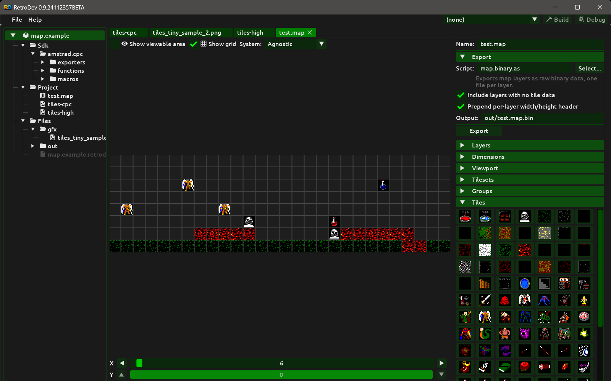

# Map Editor

The **Map** editor lets you paint tile maps across one or more layers with independent parallax speeds. Maps are target-system agnostic — they store only tile slot and index references, with no dependency on any particular hardware or colour mode. Aspect ratio preview is a display aid only and does not affect the stored map data.

## Creating a map

To create a map, right-click any folder or build item inside the **Project** section of the Project panel and select **New Map…**. A dialog prompts for a name. The name can include a virtual folder prefix using `/` as a separator (e.g. `levels/world1`). Click **Create** to add the map to the project. Double-click the map entry in the Project panel to open it.

To remove a map, right-click its entry in the Project panel and select **Remove map**.

## Document layout

The map document is split into two panels separated by a horizontal splitter:

- **Left — canvas area.** Contains the toolbar strip at the top, the tile canvas in the middle, and the X/Y scroll controls at the bottom.
- **Right — tooling panel.** Contains the name field, the export widget, and the collapsible sections: Layers, Dimensions, Viewport, Tilesets, Groups, and Tiles.

## Concepts

### Layers

A map can have any number of layers. Layers are rendered bottom-to-top. Each layer has its own tile data matrix and its own dimensions; layers in the same map do not need to be the same size.

Per-layer properties:

| Property | Description |
|---|---|
| Name | Label shown in the Layers panel. Press Enter in the name field to apply. |
| Width / Height | Layer dimensions in tiles. Set in the Dimensions panel and applied with the **Apply** button. |
| Speed | Scroll speed in tiles per camera step. `1.0` = one tile per step (foreground). Values below `1.0` scroll slower (background parallax). A value ≥ viewport width means the layer never scrolls (fixed/room). |
| Offset X / Y | Positional offset in tiles (fractional values allowed). Shifts the layer origin independently of scroll, useful for aligning layers of different sizes. |
| Visible | Toggle layer visibility on the canvas. Hidden layers are not painted on but their data is preserved. |

The **editing layer** is the layer that receives all paint operations. It is selected by clicking a layer row in the Layers panel. Only one layer is the editing layer at a time; all other visible layers are rendered read-only.

### Tileset slots

A **tileset slot** is a logical position in the map's tileset list. The slot index (1–15) is what gets encoded in the map cell data, so the actual tileset displayed for a given cell can be changed at any time without touching the map data itself.

Each slot holds one or more **variants** — different tileset build items that can be swapped in without changing any tile index in the map. This is useful for previewing the same map with different tilesets, for example one tileset converted for one target system and another for a different one, or a summer and a winter version of the same graphics.

The active variant is the one currently displayed on the canvas and used by export scripts. Switching the active variant does not change the map data.

Each slot can hold up to the number of tileset build items in the project. Each individual tileset build item can appear in at most one slot.

### Groups

A **group** is a rectangular multi-tile stamp captured from the editing layer. Groups let you place repeated structures (rooms, platforms, decorations) in a single paint operation.

To create a group: click **Add Group** in the Groups panel. The button changes to a status message and a **Cancel** button. Drag a rectangle on the canvas to define the captured region. On mouse release the region is saved as a named group and immediately selected as the active paint tool. Right-click on the canvas while in capture mode to cancel without creating a group.

Selecting a group from the list makes it the active paint tool. Left-clicking and dragging on the canvas stamps the group at the cursor position. Right-clicking erases the group footprint (sets all covered cells to empty).

Groups can be renamed by selecting them in the list and editing the name field (press Enter to apply). Groups can be removed with the **Remove Group** button.

### Viewport

The viewport defines the visible tile area (width × height in tiles) — the portion of the map that the player sees at once. It is shared across all layers.

The viewport is used for:

- The **viewable area overlay** — a blue-shaded area on the canvas that shows everything outside the player view, with a bright border marking the exact viewport boundary.
- Scroll range calculation — the scrollbar maximum for each layer is computed as `floor((layerWidth - viewWidth) / layerSpeed)` steps for X and the equivalent for Y.

## Toolbar

The toolbar strip runs across the top of the canvas area.

| Control | Description |
|---|---|
| Show viewable area | Toggle the viewport overlay. The overlay shades all canvas area outside the viewport rectangle with a blue tint. |
| Show grid | Toggle tile cell border lines on the editing layer. |
| System | Select a target system for aspect-ratio-correct canvas preview. Default is **Agnostic** (square pixels). |
| Mode | Select the screen mode (only shown when a non-Agnostic system is selected). |

### Aspect ratio preview

When a target system and mode are selected, the canvas stretches each tile cell to match that hardware's pixel aspect ratio. This is a display aid only; tile picking and painting still operate on the logical grid regardless of the visual stretch.

The supported systems and their modes are:

| System | Modes |
|---|---|
| Agnostic | — (square pixels, no correction) |
| Amstrad CPC | Mode 0, Mode 1, Mode 2 |

For example, selecting **Amstrad CPC / Mode 0** draws cells wider than tall because CPC Mode 0 pixels are non-square on a PAL display. Select **Agnostic** to return to square pixels.

## Painting

Left-click or drag to paint. Right-click to erase. All operations target the editing layer only.

If a **group** is selected, left-click stamps the entire group anchored at the cursor tile. A semi-transparent preview of the group follows the mouse before clicking. Right-click erases the group footprint.

If a **tile** is selected (from the Tiles panel), left-click places that single tile. A semi-transparent preview and a yellow highlight border show the target cell before clicking.

If nothing is selected, painting has no effect.

Arrow keys scroll the canvas when it is focused or hovered.

## Scrollbars

The X and Y scroll controls at the bottom of the canvas each consist of an arrow button, a slider, and another arrow button. Each step moves the camera by one unit. The actual tile offset for each layer is `step × layerSpeed`, clamped so that no layer scrolls past its own right or bottom edge. The slider range is computed from the widest and tallest layer in the map.

## Tooling panel

### Name

The map name field at the top of the tooling panel allows renaming the map. Press Enter to apply. If the name already exists, the rename is rejected and the field reverts.

### Layers section

- **Add Layer** — appends a new layer named "Layer N" and makes it the editing layer.
- **Layer list** — each row shows an eye icon (click to toggle visibility), the layer name, and its dimensions. Click a row to make it the editing layer.
- **Move Up / Move Down** — reorder layers. The editing layer follows the swap.
- **Remove Layer** — removes the selected layer and its data.
- **Name field** — editable name for the selected layer. Press Enter to apply.
- **Speed** — scroll speed for the selected layer (float, minimum 0.01). Use the step buttons or type directly.
- **Offset X / Y** — positional offset in tiles for the selected layer (float, fractional values allowed).

### Dimensions section

Operates on the editing layer only.

- **Width / Height** input fields — enter target dimensions (1–1024). Click **Apply** to resize, preserving tile data in the overlapping region. Cells outside the old bounds are filled with empty (0).
- **Row** buttons — add or remove a row at the top or bottom of the editing layer. Adding inserts an empty row and shifts existing data. Removing the top row shifts all rows up by one.
- **Col** buttons — add or remove a column at the left or right of the editing layer. Adding inserts an empty column and shifts existing data. Removing the left column shifts all columns left by one.
- Remove buttons are disabled when the layer is already 1 tile in that dimension.

### Viewport section

- **View Width** — number of tiles visible horizontally (1–1024).
- **View Height** — number of tiles visible vertically (1–1024).

Changes take effect immediately for the viewable area overlay and scrollbar range.

### Tilesets section

- **Add Tileset…** button — opens a popup listing all tileset build items in the project that have not yet been added. Selecting one creates a new slot containing that tileset as its first (and only) variant.
- **Tileset list** — shows all slots. Each entry shows the active variant name and, when there is more than one variant, the number of additional variants. Clicking a slot selects it and clears the tile selection.
- **Variant switcher** — shown when the selected slot has more than one variant: left/right arrow buttons and a dropdown combo to switch the active variant.
- **Add Variant…** — opens a popup listing all tileset build items not already in this slot. Selecting one appends it as a new variant and makes it active.
- **Remove Variant** — removes the current variant from the slot. Disabled when the slot has only one variant.
- **Remove** — removes the entire selected slot from the map. All cells encoded with this slot index will point to a missing slot until re-assigned.

### Groups section

- **Add Group** — enters capture mode. Drag on the canvas to define the region; release to create the group. Right-click or **Cancel** to abort.
- **Group list** — shows all saved groups. Clicking a group selects it as the active paint tool and clears the tile selection.
- **Name field** — editable name for the selected group. Press Enter to apply.
- **Remove Group** — removes the selected group. The button is disabled when no group is selected.

### Tiles section

Shows when a tileset slot is selected. Displays all extracted tiles from the active variant as 32×32 pixel thumbnails, wrapping across the available panel width. Click a tile to select it as the active paint tool (clears any group selection). The selected tile is highlighted with a different button colour.

If the tileset has no extracted tiles, a message is shown instead.

## Cell data encoding

Each map cell is stored as a 16-bit word. The top 4 bits encode `slotIndex + 1` (values 1–15, so up to 15 tileset slots per map). The bottom 12 bits encode the tile index within that slot (values 0–4095). A value of 0 means empty.

This compact representation is intentional: the target machines are retro systems with limited memory and processing power, so a single 16-bit word per cell is both sufficient and efficient. 15 tileset slots and up to 4095 tiles per slot cover all practical use cases for retro hardware without wasting RAM in the map data itself.

## Export

Map data is available to export scripts as tile cell arrays per layer, along with layer properties and tileset slot information. See [export-scripts.md](export-scripts.md) for the `IMapContext` API.
