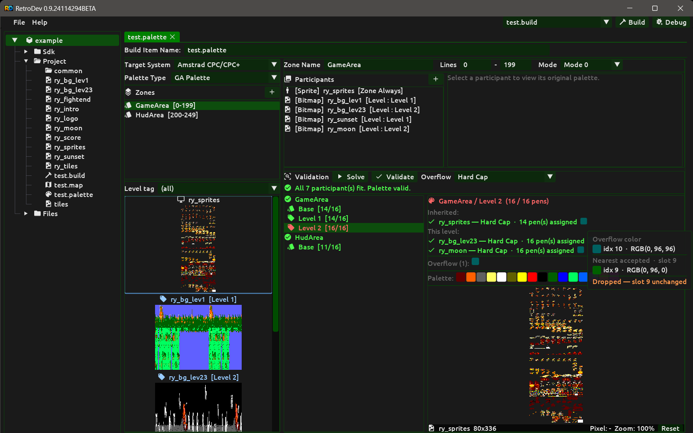

# Palette Solver

The **Palette** build item solves colour assignment constraints across multiple graphics items that share screen space or swap in and out during a game. It does not export data by itself — its purpose is to compute a shared palette and write the result back into the participating build items (bitmaps, tilesets, sprites). Those items then carry the solved palette into their own exports.

## The problem it solves

Retro systems have a fixed number of hardware colour registers. If you have a background tileset, a player sprite, level-specific decorations and a HUD, they all have to fit inside those registers simultaneously — or you have to split the screen into scanline zones, each with its own palette, using raster interrupts.

Working this out by hand across a whole game is error-prone and time-consuming. Every time you tweak a graphic you have to re-check whether it still fits alongside everything else. The palette solver automates this: you declare which graphics share which screen area and under which conditions, run the solver, and if it succeeds you validate the result to write the solved palette assignments back into each graphic's build item configuration. Subsequent conversions for those items then use the solved palette automatically.

## Creating a palette build item

To create a palette build item, right-click any folder or build item inside the **Project** section of the Project panel and select **New Palette…**. Enter a name and click **Create**. Double-click the entry in the Project panel to open it.

To remove a palette build item, right-click its entry in the Project panel and select **Remove palette**.

## Renaming a palette build item

At the top of the palette document an editable **Build Item Name** field shows the current name. Edit it and press **Enter** to rename the item. If the new name is already taken the rename is rejected and the field reverts to the existing name.

## Document layout

The palette document is divided into three areas:

- **Left panel** — target system and palette type selectors, zone list, and participant thumbnails.
- **Right top panel** — zone properties (name, scanlines, mode) and participant list with per-participant settings.
- **Right bottom panel** — solve and validate controls, solution result list, solved palette display, and solved preview image.

The left/right split and the top/bottom split within the right panel are both adjustable by dragging the splitter bars.

## Concepts

### Target system and palette type

At the top of the left panel, select the **Target System** and **Palette Type** that this palette build item targets. Only build items (bitmaps, tilesets, sprites) configured for the same system and palette type are available as participants.

Changing the palette type clears all participants from all zones, because the available colour set changes and any prior assignments are no longer meaningful.

### Screen zones

A **screen zone** is a horizontal scanline band that shares a single hardware palette. On retro systems, a raster interrupt fires at a specific scanline and swaps the hardware palette registers mid-frame, allowing the upper and lower parts of the screen to use completely different colours.

For a full-screen game with no raster tricks one zone covers the full screen (e.g. lines 0–199). For a game with a HUD at the top you might use two zones: one for the game area and one for the status bar.

Each zone has:

| Property | Description |
|---|---|
| Name | Free-text label (e.g. "Game Area", "Status Bar"). |
| Lines | First and last scanline of the zone (inclusive, 0-based). |
| Mode | Screen mode for this zone. Different zones can use different modes (e.g. Mode 0 gameplay + Mode 1 status bar). Changing the mode invalidates the current solution. |

Zones are listed in the left panel. Click **+** to add a zone. Right-click a zone in the list and select **Remove zone** to delete it. The zone list shows each zone's name and scanline range. Clicking a zone selects it and shows its properties and participants in the right panel.

A new palette build item starts with one default zone named "Main" covering lines 0–199.

### Participants

A participant is a graphics build item (bitmap, tileset, or sprite) that must fit within a zone's colour budget. Only items configured for the same target system and palette type as the palette build item are shown in the build item combo.

Each participant has three properties:

**Build Item** — which bitmap, tileset or sprite this participant refers to. Selected from a combo showing all compatible items in the project, grouped by type.

**Role** — how often this graphic is present:

| Role | Description |
|---|---|
| Always | Present in every zone and every level. Its colours are pooled globally across all zones so the same pen slots hold the same colours everywhere. Typical use: HUD, status bar, player sprite. |
| Zone Always | Always present within this zone across all levels, but not shared across other zones. Its colours are added on top of the global Always base for this zone only. |
| Level | Present only when a specific game level is active. Use the **Tag** field to name the level (e.g. `Level1`). Only graphics sharing the same tag are combined when solving that level. |

**Tag** — shown only for the Level role. A free-text string grouping participants that appear together. All participants with the same tag are solved together as a group on top of the zone base palette. Click the **▼** arrow button next to the tag field to pick an existing tag from the current zone instead of typing it manually.

To add a participant, click **+** in the Participants header inside the right panel. A new empty participant is added and selected. Set its Build Item, Role and Tag. To remove a participant, right-click it in the list and select **Remove**.

### Original palette panel

When a participant is selected in the list, the right sub-panel inside the zone editor shows the participant's **original palette** — the palette that item's own conversion produced, before the solver overrides it. This is read-only and is provided as a reference so you can see how many colours the item uses independently.

### Thumbnails

Below the zone list in the left panel, participant thumbnails are shown for the currently selected zone. Each thumbnail displays the participant's name, its role icon, and — after a successful solve — the image as it looks converted with the solved palette. Before solving, a "solve to preview" message is shown instead.

A **Level tag** combo above the thumbnail area filters which Level participants are shown. Selecting a specific tag shows only participants with that tag. Selecting **(all)** shows every participant regardless of tag.

Clicking a thumbnail selects it. The selected thumbnail is highlighted with a blue border and its solved preview is shown in the right bottom panel alongside the solved palette.

## The solver

### Overflow method

Next to the **Solve** and **Validate** buttons, the **Overflow** combo controls what happens when a set of participants has more unique colours than the hardware pen budget allows:

| Method | Description |
|---|---|
| Hard Cap | Truncate the union colour list at the pen limit. Priority order (Always > Zone Always > Level) ensures the most important colours survive. Dropped colours are remapped to the nearest surviving entry. |
| Soft Cap | For each overflow colour, find the nearest accepted entry and replace it with the system colour closest to their 50/50 RGB midpoint. Packs more perceptual variety into fewer pens at some cost to accuracy. |
| Weighted Blend | Like Soft Cap but the blend is 67% accepted + 33% overflow. Accepted colours shift only slightly toward overflow neighbours, preserving dominant colour fidelity better while still gaining some coverage. |
| Median | Cluster each overflow colour with the accepted entry it is nearest to, then replace the accepted entry with the RGB centroid of the whole cluster. Multiple overflow colours hitting the same accepted entry are absorbed equally, spreading the compromise evenly. |

### Three-pass solve

Clicking **Solve** runs the solver across all zones and all participants.

The solver operates in three passes:

**Pass 1 — global Always base.** All `Always` participants from every zone are quantized together into a single base palette. This ensures the same pen slots hold the same hardware colours in every zone and every level. Always participants are the most important and receive priority in the pen budget.

**Pass 2 — zone base.** For each zone, `Zone Always` participants are fitted on top of the global Always pens. This produces the stable zone base palette: the set of pens that are occupied regardless of which level is active.

**Pass 3 — level tags.** For each zone, for each distinct Level tag, the `Level` participants with that tag are fitted on top of the zone base palette. Each (zone × tag) combination produces one independent solution. Level participants only consume pens beyond what the base already uses.

The solve never modifies the project. All palette work is done on temporary converter instances.

### Solution result list

After solving, a summary line appears above the result list showing whether all zones and tags fit within their pen budgets (green) or whether at least one combination overflowed (red).

Below the summary the right bottom panel shows a list of all (zone × tag) entries. Each entry is colour-coded:

- **Green** — all participants for this combination fit within the pen budget.
- **Red** — one or more participants overflowed the pen budget.

Each entry shows how many pens were used out of how many are available (e.g. `4/16`). Selecting an entry in the list shows the solved palette for that combination and the per-participant results.

Per-participant result icons:

| Icon | Status | Meaning |
|---|---|---|
| ✓ | OK | All colours fit; pens consumed is shown. |
| palette | Pen Overflow | The item had more unique colours than remaining free pens. |
| ? | Missing / Load Failed | The build item was not found in the project or its source image could not be loaded. |
| − | Skipped | The participant does not apply to this solve context (e.g. a Level participant whose tag does not match). |

For level solutions, the result list first shows inherited base participants under an **Inherited:** heading (Always and Zone Always from the base pass), then the participants specific to this tag under a **This level:** heading.

### Overflow remap strip

When overflow colours exist for a selected solution, a strip of colour swatches appears below the per-participant results, one swatch per overflow colour. Hovering a swatch shows a tooltip with the overflow colour's RGB values, the nearest accepted pen slot, and how that slot was updated (or left unchanged) by the chosen overflow method.

### Solved palette strip

Below the per-participant results (and the overflow remap strip if present), a compact row of colour swatches shows the final solved palette — one swatch per pen slot. Occupied slots show their solved hardware colour; free slots appear as dark grey. Hovering a swatch shows the pen number, system colour index and RGB values.

### Validate

Once satisfied with the solution, click **Validate**. This writes the solved palette assignments back into each participant's stored build item configuration (`PaletteLocked`, `PaletteEnabled`, `PaletteColors` arrays). Subsequent conversions for those items will then use the locked pen assignments produced by the solver.

The project is marked as modified and must be saved to persist the changes. All open documents for affected build items are notified and refresh their previews immediately.

Validate is only available after a successful solve. If any participating build items are changed after solving (e.g. their conversion parameters are modified), the solution is automatically invalidated and must be re-solved before validating again.

## Workflow summary

1. Create a **Palette** build item and open it.
2. Select **Target System** and **Palette Type**.
3. Add one or more **zones** with appropriate scanline ranges and screen modes.
4. For each zone, add **participants** (bitmaps, tilesets, sprites) with their roles. Level participants also require a tag.
5. Click **Solve** and inspect the result list. Check that all entries are green.
6. If there are overflows, reduce the number of colours in the affected graphics (via their own conversion settings) or reorganise participants into different zones.
7. Once the solve is clean, click **Validate** to write the assignments back.
8. Save the project. Each participating build item now carries the solved palette and will use it in subsequent conversions and exports.
