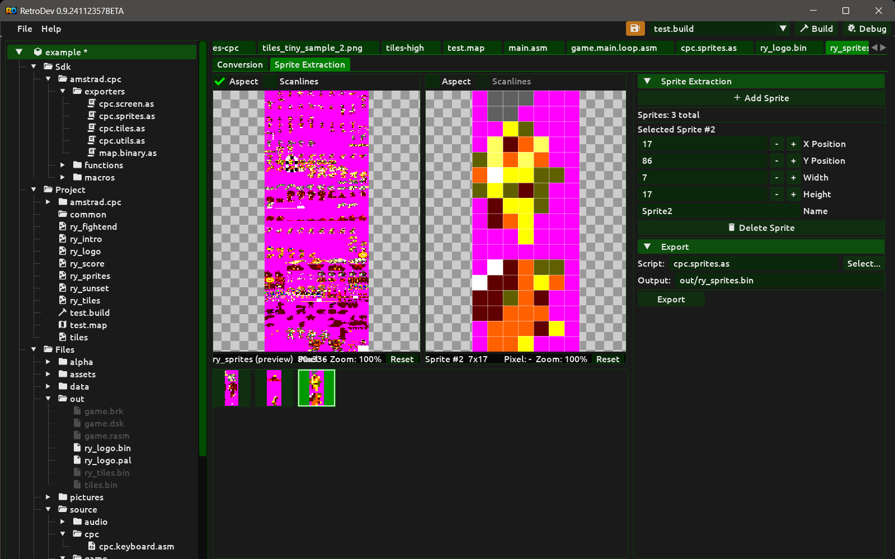

# Sprite Extraction

A **Sprites** build item combines a full bitmap conversion with a sprite region definition step. The editor has two tabs: **Conversion** and **Sprite Extraction**.

## Creating a sprites build item

1. In the **Project** panel, right-click the source image file you want to use.
2. Select **Add sprites conversion** from the context menu. Retrodev creates the build item with that image already set as the source.
3. Configure the conversion in the **Conversion** tab first, then switch to the **Sprite Extraction** tab to define the individual regions.

## Conversion tab

The Conversion tab is identical to the [Bitmap Conversion](bitmaps.md) editor. It contains the same dual-panel image viewer, palette panel and tooling panel with all the same parameters: target system, mode, resolution, palette type, resize, colour correction, quantization and dithering. All preview and palette controls work in the same way, including transparent colour picking.

The converted image produced here is the source for sprite extraction. All sprite regions are cut from the native-resolution converted image, not from the original source image or the aspect-corrected preview.

## Sprite Extraction tab

The Sprite Extraction tab is where you define, preview and manage the individual sprite regions.

### Layout

The tab is divided into a left area and a right tooling panel.

The left area has a vertical splitter with two sections:

- **Top — dual image viewer**: the left panel shows the full converted image; the right panel shows the currently selected sprite. Each panel has its own independent **Aspect** and **Scanlines** preview controls. The aspect and scanlines controls on the left panel re-trigger conversion when changed; the controls on the right panel apply only to the sprite preview without affecting the conversion. The two panels are not synchronised — they zoom and pan independently.
- **Bottom — sprite list**: a thumbnail grid of all defined sprites.

The right tooling panel contains the **Sprite Extraction** section for adding, editing and deleting sprite definitions, followed by the **Export** section.

### Sprite list

The sprite list shows all defined sprites as a grid of thumbnails. Each thumbnail is drawn at up to 64 × 64 pixels, aspect-ratio-fitted within its cell.

**Selection**

The sprite list supports multiselection:

- **Plain click** — selects the clicked sprite and clears any previous selection.
- **Ctrl+click** — toggles the clicked sprite in or out of the current selection without clearing it.
- **Shift+click** — range-selects all sprites from the last clicked sprite to the current one, adding them to the current selection.

The primary sprite (last clicked) is highlighted with a gold border. Other selected sprites are highlighted with a white border. The region of the primary sprite is drawn as a selection box on the full converted image in the left panel above.

Hovering a thumbnail shows a tooltip with the sprite's index, name (if set), position and size. When more than one sprite is selected the tooltip also shows the total selection count.

Right-clicking a thumbnail opens a context menu that operates on the entire current selection. If the right-clicked sprite is not already selected it first becomes the sole selection. When multiple sprites are selected a header line shows the count. The menu has four groups:

**Duplicate submenu** — creates a copy of the sprite and appends it to the end of the list:

| Entry | Description |
|---|---|
| Duplicate | Plain copy. Name gets `_copy` suffix. |
| Duplicate + Flip Horizontal | Copy with pixels mirrored left-to-right. Name gets `_fh` suffix. |
| Duplicate + Flip Vertical | Copy with pixels mirrored top-to-bottom. Name gets `_fv` suffix. |
| Duplicate + Shift Left | Copy shifted one pixel left (cyclic wrap). Name gets `_sl` suffix. |
| Duplicate + Shift Right | Copy shifted one pixel right (cyclic wrap). Name gets `_sr` suffix. |
| Duplicate + Shift Up | Copy shifted one pixel up (cyclic wrap). Name gets `_su` suffix. |
| Duplicate + Shift Down | Copy shifted one pixel down (cyclic wrap). Name gets `_sd` suffix. |

**Flip submenu** — transforms the existing sprite in place:

| Entry | Description |
|---|---|
| Flip Horizontal | Mirrors the sprite left-to-right. Toggles the flip state — applying again restores the original. |
| Flip Vertical | Mirrors the sprite top-to-bottom. Same toggle behaviour. |

**Shift submenu** — moves the pixel content of the existing sprite one step in the chosen direction, wrapping cyclically within the bounding box:

| Entry | Description |
|---|---|
| Shift Left | Shifts pixel content one step left; the leftmost column wraps to the right edge. |
| Shift Right | Shifts pixel content one step right; the rightmost column wraps to the left edge. |
| Shift Up | Shifts pixel content one step up; the top row wraps to the bottom edge. |
| Shift Down | Shifts pixel content one step down; the bottom row wraps to the top edge. |

**Remove** — removes all selected sprites from the list.

All duplicate operations create one copy per selected sprite, append each copy to the end of the list, run extraction immediately, and select the newly created entries. In-place flip and shift operations re-run extraction immediately on every selected sprite.

### Adding a sprite

Click the **Add Sprite** button in the right tooling panel to enter selection mode. While selection mode is active:

- A **Selection Mode Active** label appears at the top of the tooling panel.
- Click and drag on the converted image in the left panel to draw a rectangular region. The **X**, **Y**, **Width** and **Height** values in the tooling panel update live as you drag.
- Enter a name in the **Sprite Name** field. A default name is generated automatically from the current sprite count.
- Click **Done** to confirm and add the sprite. The button is disabled until the selection covers at least 1 × 1 pixel.
- Click **Cancel** to discard the selection and exit selection mode without adding a sprite.

When confirmed, the sprite is added to the list, extraction runs immediately from the converted image, and the new sprite is automatically selected.

### Editing a sprite

When a sprite is selected, its properties appear in the tooling panel below the sprite count:

- **X Position** and **Y Position** — the top-left corner of the sprite region within the converted image. Values are clamped to a minimum of zero.
- **Width** and **Height** — the size of the region in pixels. Values are clamped to a minimum of one.
- **Name** — a label for the sprite used to identify it in export scripts.

Any change to these fields immediately re-runs extraction so the sprite list and preview update at once.

Click **Delete Sprite** to remove the selected sprite from the list and re-run extraction.

### Sprite preview

The right panel of the image viewer shows the currently selected sprite at native resolution. It has its own independent **Aspect** and **Scanlines** controls — enabling aspect correction applies the hardware display ratio to the sprite preview without re-converting the full image. The pixel grid is active from zoom level 1× in this panel, so individual pixels are visible as soon as you begin zooming in.

## Export

Attach an AngelScript export script via the **Export** section of the right tooling panel. The script receives access to the extracted sprites and the conversion context. For the complete export API, see [export-scripts.md](export-scripts.md).
