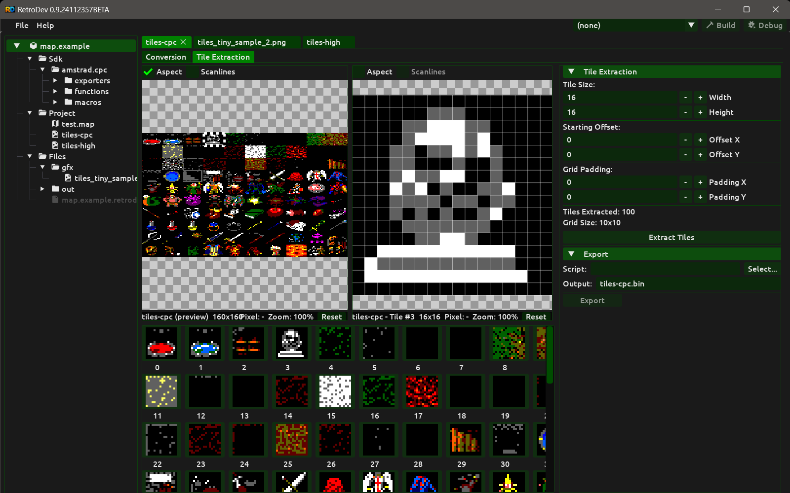

# Tile Extraction

A **Tiles** build item converts a source image for a target system and then slices the converted result into a regular grid of tiles. Each tile can be individually previewed and selectively excluded from the final output.

## Creating a tileset conversion

To create a tileset conversion, right-click an image file in the **Files** panel and select **Add tileset conversion**. The image must already be included in the project. The new build item takes its name from the image filename (without extension) and appears in the **Build** section of the Project panel. Double-click it to open the tileset document.

To remove a tileset conversion, right-click its entry in the Build section and select **Remove tileset conversion**.

## Document layout

The tileset document has two tabs: **Conversion** and **Tile Extraction**.

## Conversion tab

The Conversion tab is identical to the Bitmap document. It shows the source image and the converted preview side by side, with the palette and conversion parameters in the right-hand tooling panel.

See [bitmaps.md](bitmaps.md) for a full description of the conversion workflow, palette controls, and preview options.

## Tile Extraction tab

The Tile Extraction tab is where tiles are defined, extracted, and managed.

### Layout

The tab is divided into three areas:

- **Left top — dual image viewer.** The left panel shows the full converted preview with a selection rectangle highlighting the currently selected tile. The right panel shows the selected tile in isolation. Both panels have independent zoom and pan controls; they are not synchronised.
- **Left bottom — tile list.** A scrollable grid of all tile thumbnails.
- **Right — tooling panel.** Contains the tile extraction parameters and the export widget.

### Preview controls

Each panel in the dual viewer has its own **Aspect correction** and **Scanlines** checkboxes. On the left panel, toggling these options re-runs the conversion. On the right panel (single tile view), they regenerate the tile preview using `GeneratePreview` without re-running the full conversion.

For zoom, pan, and pixel grid behaviour, the controls are the same as described in the Preview section of [bitmaps.md](bitmaps.md).

### Tile extraction parameters

The **Tile Extraction** collapsible section in the right tooling panel contains all grid parameters.

**Tile Size**

| Parameter | Description |
|---|---|
| Width | Width of each tile in pixels. Minimum value is 1. |
| Height | Height of each tile in pixels. Minimum value is 1. |

**Starting Offset**

| Parameter | Description |
|---|---|
| Offset X | Horizontal offset in pixels from the left edge of the converted image before the grid starts. Minimum value is 0. |
| Offset Y | Vertical offset in pixels from the top edge of the converted image before the grid starts. Minimum value is 0. |

**Grid Padding**

| Parameter | Description |
|---|---|
| Padding X | Horizontal gap in pixels between adjacent tiles in the grid. Minimum value is 0. |
| Padding Y | Vertical gap in pixels between adjacent tiles in the grid. Minimum value is 0. |

Below the parameters, the panel displays:

- **Tiles Extracted** — the number of tiles currently extracted.
- **Grid Size** — the computed grid dimensions as columns × rows, derived from the converted image size and the parameters above.

Any change to any grid parameter immediately clears the deleted tiles list, since the grid structure has changed and previous deletion indices are no longer valid.

Tile extraction always operates on the native-resolution converted image, not on the scaled preview.

### Extract Tiles button

Clicking **Extract Tiles** re-runs the full conversion and then slices the converted image into tiles according to the current parameters. The tile list updates immediately to show the new results. Extraction must be triggered manually after adjusting parameters.

Two further buttons appear below **Extract Tiles**:

- **Remove Duplicates** — compares the raw pixel data of every non-deleted tile against all tiles that precede it in the grid. Any tile whose pixels are identical to an earlier tile is marked as deleted. The number of tiles removed is logged to the Console. The button is disabled until at least one tile has been extracted.
- **Undelete All** — clears the entire deleted-tiles list, restoring all previously deleted tiles to active. The number of tiles restored is logged to the Console. The button is disabled when there are no deleted tiles.

### Pack to Grid

**Pack to Grid** is a pre-processing step for source images where the tile graphics are scattered irregularly across the image, separated by a solid background colour, rather than already being arranged in a regular grid.

Pressing **Pack to Grid** detects every content region in the converted image and computes the bounding box of each region. It then finds the **smallest detected region** and uses its dimensions as the base tile unit. Any region whose bounding box is larger than that unit is subdivided into a grid of cells matching the smallest size — this handles source images where a background graphic is composed of several tiles placed side by side, which would otherwise be merged into one oversized bounding box. All resulting cells are rearranged into a new uniform grid image. The tile extractor then works on that packed image using the automatically detected cell dimensions. No manual offset or padding adjustments are needed after packing.

The following options control the detection:

| Option | Description |
|---|---|
| Background (colour picker) | The solid background / separator colour surrounding the tile chunks. Set this to the fill colour of the source image (e.g. magenta). |
| Sample | Reads the colour of pixel (0, 0) from the converted image and sets it as the background colour. Useful when the background is a uniform flood fill. |
| Merge gap | Pixel gap between adjacent detected regions that will be merged into a single bounding box before packing. Use 0 to keep all regions as separate bounding boxes. Increase this value when a single logical tile is made up of closely spaced sub-regions. Large merged bounding boxes are subsequently subdivided by the smallest detected tile unit. |
| Cell padding | Pixel gap inserted between cells in the packed output image. |
| Columns | Number of columns in the packed grid. 0 selects automatic layout (nearest square root of the region count). |

After packing:

- The tile width and height parameters are updated automatically to match the detected cell dimensions.
- All offset and padding parameters are reset to 0.
- The deleted-tiles list is cleared.
- Tiles are extracted immediately from the packed image.
- The left panel of the dual viewer shows the packed image instead of the full converted preview.

To revert to the original converter output, adjust the parameters and press **Extract Tiles**. This clears the packed image and re-extracts from the converter result.

### Tile list

The tile list shows all tile positions in the grid as 64×64 pixel thumbnails arranged in rows. The number of columns adjusts automatically to the available panel width.

**Selection**

The tile list supports multiselection:

- **Plain click** — selects the clicked tile and clears any previous selection.
- **Ctrl+click** — toggles the clicked tile in or out of the current selection without clearing it.
- **Shift+click** — range-selects all tiles from the last clicked tile to the current one, adding them to the current selection.

The primary tile (last clicked) is highlighted with a gold border. Other selected tiles are highlighted with a white border. The right panel of the dual viewer shows the primary tile in isolation, and a selection rectangle is drawn over its position in the left (full preview) panel.

A tooltip appears on hover showing the tile index and its pixel dimensions. For deleted tiles the tooltip shows **DELETED** instead of the dimensions. When more than one tile is selected the tooltip also shows the total selection count.

**Deleting and restoring tiles**

Right-clicking a tile opens a context menu that operates on the entire current selection. If the right-clicked tile is not already selected it first becomes the sole selection. The menu adapts to the state of the selection:

- **All active** — shows **Delete** (single tile) or **Delete All** (multiple tiles).
- **All deleted** — shows **Undelete** (single tile) or **Undelete All** (multiple tiles).
- **Mixed** — shows **Delete Active** and **Undelete Deleted** as separate entries, each acting only on the relevant subset.

Deleted tiles remain visible in the list but are rendered as a dark red placeholder with a red cross drawn over them. Their index label is shown in red. Deleted tiles are excluded from export.

To restore all deleted tiles at once, click **Undelete All** in the tooling panel. To mark all pixel-identical tiles as deleted in one step, click **Remove Duplicates**. Both buttons are described in the [Extract Tiles button](#extract-tiles-button) section above.

## Using tiles in a map

Once extracted, the tile sheet is available as a tileset source in the **Map** editor.

See [maps.md](maps.md) for details on painting maps with extracted tiles.

## Export

The tile extractor exposes all tile images and the deleted-tiles list to export scripts. See [export-scripts.md](export-scripts.md) for the `ITilesetContext` API.
